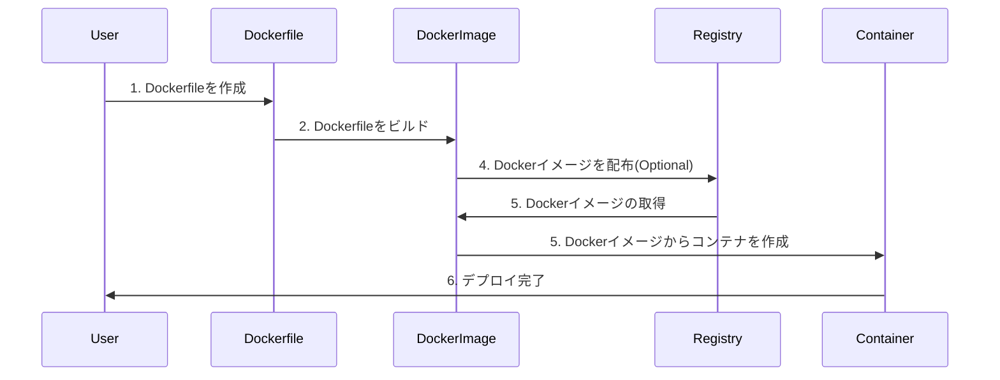
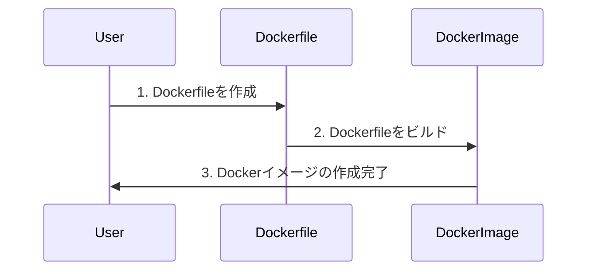

# Dockerについて


---

# 目次

<Toc maxDepth="1"></Toc>

---

# Dockerとは

Dockerはコンテナを作成、配布、実行するためのプラットフォームです。

いくつかあるコンテナエンジンの一つ。(podman, rktなど)

Dockerが事実上のデファクトスタンダードとなっている。


---

# 言葉の定義

- イメージ
    - コンテナの元となるひな形のようなもの
  
- コンテナ 
    - dockerイメージを実行する実体（インスタンス）

- レジストリ
    - イメージを保存する場所(Docker Hub, GitHub Container Registryなど)

---

# デプロイまでの流れ




すでにあるイメージを使う場合は、5から始める。

---

# Dockerfileについて

Dockerイメージを作成するための手順書のようなもの

```dockerfile
# ベースイメージの指定
FROM node:16 
# 作業ディレクトリの指定
WORKDIR /app
# ファイルのコピー
COPY . .
# パッケージのインストール
RUN npm install
# ビルド
RUN npm run build
# ポートの指定
EXPOSE 8080
# コマンドの実行
CMD [ "npm", "start" ]
```

---

# ビルドのコマンド

```bash
docker build -t my-node-app:latest .
```

- `-t` イメージ名を指定 (今回は `my-node-app:latest` という名前を指定)
- `.` カレントディレクトリを指定
- `latest` タグを指定 (省略可能) 

タグをつけることで、イメージを識別することができる。(バージョンの管理など)

---

# ビルドの流れ



---
layout: two-cols
---

# Distrolessについて(応用)

Dockerfileは、ビルドと実行の環境を明確に分けることができる。

- ビルド環境には、ビルドに必要なツールをインストールする。

- 実行環境には、不必要なツールをインストールしないようにする。

## distroless

- Googleが提供している、最小限のOSを提供するイメージ
- シェルやパッケージマネージャが含まれていない

::right::
```dockerfile {*|1-15|16-26}
# ビルド環境
FROM --platform=$BUILDPLATFORM golang:1.22.4 as build
RUN mkdir /storage

WORKDIR /go/src/github.com/kstm-su/Member-Portal/backend/

COPY ./go.* ./

RUN --mount=type=cache,target=/go/pkg/mod go mod download

...省略...

COPY . .
RUN --mount=type=cache,target=/go/pkg/mod --mount=type=cache,target=/tmp/go/cache \
    go build -o /Member-Portal

# 実行環境
FROM gcr.io/distroless/static-debian11
WORKDIR /app
EXPOSE 8080

COPY --from=build /storage/ /app/storage/
VOLUME /app/storage

COPY --from=build /Member-Portal ./
CMD ["./Member-Portal"]
```

---

# Dockerの実行

```bash
docker run -p 80:8080 my-node-app
```

- `-p` ポートのマッピング
- `8080:80` ホストの80番ポートをコンテナの8080番ポートにマッピング

---

# Docker Composeについて

複数のコンテナを一括で管理するためのツール

WordPressとMySQLなどのように、複数のコンテナを連携させる際に便利


```yaml
version: '3'

services:
  db:
    image: mysql:5.7
    volumes:
      - db_data:/var/lib/mysql
    restart: always
    #...省略

  wordpress:
    depends_on:
      - db
    image: wordpress:latest
    ports:
      - "8000:80"
    restart: always
    #...省略
```

---

# Docker Composeの実行

```bash
docker-compose up　-d
```

- `up` コンテナの起動
- `-d` バックグラウンドで起動


---

# 参考文献

- [Docker Documentation](https://docs.docker.com/)
- [docker 用語集](https://docs.docker.jp/glossary.html)
- [コンテナイメージ使うならdistrolessもいいよねという話](https://zenn.dev/yoshii0110/articles/21ddb58c6f6bfa)
- [クィックスタート: Compose と WordPress](https://docs.docker.jp/compose/wordpress.html)
